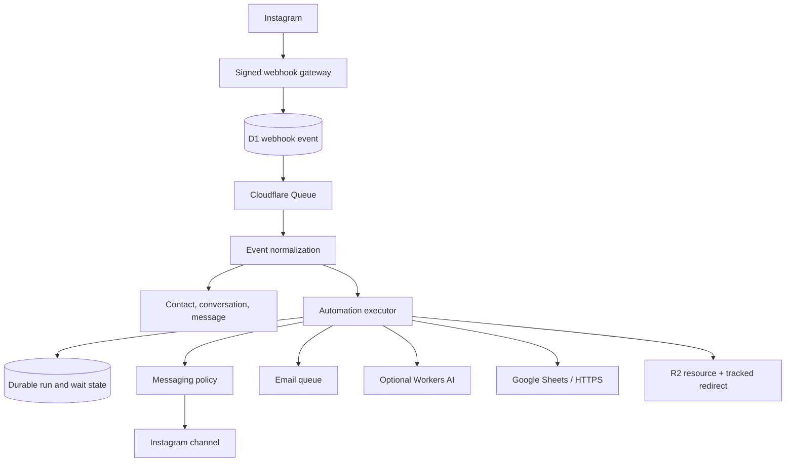

# Architecture

Inbox Orchard is a single-tenant Cloudflare application. A deployment has no dependency on a central Inbox Orchard service.

## Runtime flow

The webhook response is acknowledged only after its raw body and idempotency hash are stored. Processing occurs asynchronously. The durable-jobs table also provides a scheduled fallback/replay path so work remains inspectable when a queue delivery fails.

## Application boundaries

| Area | Implementation | Responsibility |
|---|---|---|
| UI | React, Vite, React Flow | Owner dashboard, inbox, CRM, workflow authoring, simulator, integrations |
| HTTP | Hono Worker | Authentication, validation, APIs, OAuth callbacks, redirects, resource delivery |
| Data | Cloudflare D1 | Configuration, contacts, messages, immutable workflow versions, run/wait state, queues, analytics |
| Async | Cloudflare Queues + cron | Webhooks, email, delays, sequence work, retries, scheduled triggers |
| Files | Cloudflare R2 | Controlled creator-resource uploads |
| AI | Workers AI adapter | Optional intent/reply/workflow proposals; never required for keywords |
| Providers | Instagram, Gmail, Brevo, Sheets, HTTPS adapters | Centralized external request and error/rate-limit handling |

## Automation model

An automation is schema-versioned JSON containing a trigger, nodes, edges, and settings. Publishing points the automation at an immutable version. Running executions keep that version ID even when a new draft is saved.

The executor persists every run and node step. `ask_question`, explicit response waits, delays, and wait-until nodes write `automation_wait_states`; later inbound messages or scheduled jobs resume the same run. A unique `(automation_id, trigger_event_id)` constraint and message/send idempotency keys prevent duplicate webhook deliveries from producing duplicate runs or sends.

## Trigger ordering and conflict control

Published candidates are ordered deterministically by priority and creation. An automation can acquire the conversation's automation lock. With `stopOtherAutomations` enabled, later matches do not blindly reply over the active run. Manual owner actions remain explicit and policy checked.

## Messaging policy

The executor does not call Meta directly. It requests an action from the Instagram channel after the policy layer checks action type, last eligible inbound interaction, comment age, and whether a comment private reply was already used. Policy denials are logged as run-step errors rather than hidden.

## FREE MODE degradation

Core event persistence and deterministic automations do not depend on AI or email availability. AI errors are treated as optional feature failures. Email actions always enter D1 first; missing senders, daily safety limits, and retryable provider failures leave a visible queued/retrying record.

## Security boundaries

Browser code never receives provider access/refresh tokens. OAuth tokens and provider keys are sealed using `ENCRYPTION_KEY`; session signing uses a separate `SESSION_SECRET`. Webhooks use raw-body HMAC verification. Backup exports select only whitelisted non-secret columns. Outbound workflow requests accept only public HTTPS URLs and perform hostname/IP checks before dispatch.

## Data ownership and migration

The owner can export contacts/analytics as CSV, workflows as portable JSON, and non-secret configuration as a schema-versioned backup. Uploaded R2 object bytes must be copied separately. Each deployment applies numbered D1 migrations and owns all provider bindings in its own Cloudflare account.
